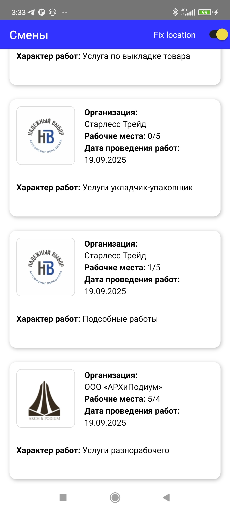

# Тестовое задание в "Рабочие руки".

## Для запуска c дебаггером

```
npm run android
```

## Для установки

```
cd android
./gradlew assembleRelease
adb install -r app/build/outputs/apk/release/app-release.apk
```

<br>
<br>

## Собиралось и проверялось на Android

<br>
<br>

## Вид собранного приложения


<br>
<br>



<br>
<br>
